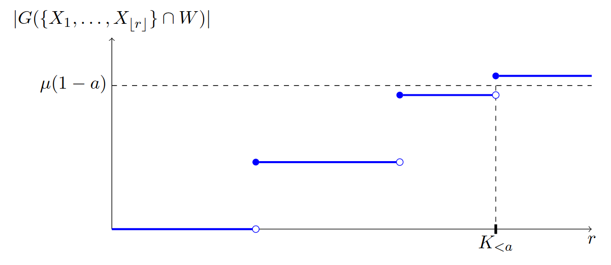

# Rare events in random geometric graphs

Let  be a Poisson point process with intensity  0" /> in . Let  be the **Gilbert graph** on , where two points  are linked if and only if their Euclidean distance is smaller than a threshold, say 1. Our goal is toanalyze the probability of the rare event that the number of edgesin a bounded sampling window deviates considerably from its expected value. More succinctly, we ask:

- What is the probability that the Gilbert graph has at least twice its expected number of edges?
- What is the probability that the Gilbert graph has at most half its expected number of edges?

</a>

These questions pertain to a problem of estimating rare-event probabilities that we approach through two channels in [our notebook](rao_blackwell.ipynb). First, we illustrate that a surprisingly simple conditional Monte Carlo separating the location and the number of Poisson points yields already an impressive reduction in variance. Then, we leverage recent insights from large deviations in random geometry as a guide for constructing a fine-tailored importance sampling scheme that brings further improvements. Feel free to browse through the [companion preprint](https://arxiv.org/pdf/2007.05965.pdf).
